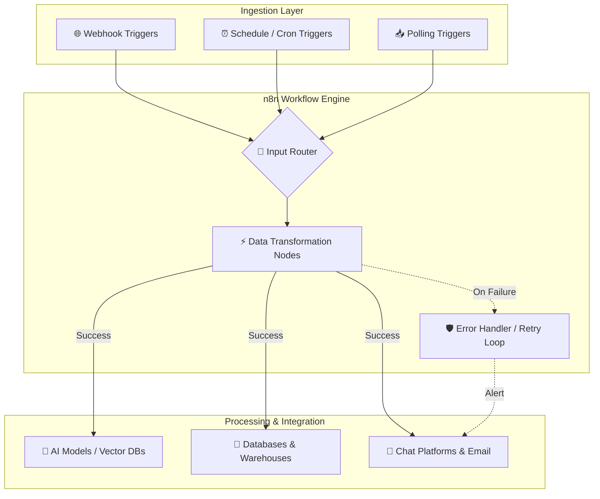

# ⚡ n8n Advanced Workflows & Automation Blueprints

<div align="center">


**A production-ready repository containing enterprise-grade n8n JSON blueprints, custom node pipelines, and modular automation architectures.**

[Import Guide](#-how-to-import-blueprints-into-n8n) • [Blueprint Catalog](#-interactive-blueprint-catalog) • [Architecture](#-system-architecture) • [Troubleshooting](#-troubleshooting--faq)

</div>

---

## 📋 Table of Contents

1. [Overview](#-overview)
2. [Interactive Blueprint Catalog](#-interactive-blueprint-catalog)
3. [System Architecture](#-system-architecture)
4. [Performance Benchmarks](#-performance-benchmarks)
5. [How to Import Blueprints into n8n](#-how-to-import-blueprints-into-n8n)
6. [Repository Structure](#-repository-structure)
7. [Environment Configuration](#-environment-configuration)
8. [JSON Blueprint Format Reference](#-json-blueprint-format-reference)
9. [Troubleshooting & FAQ](#-troubleshooting--faq)
10. [Contributing](#-contributing)
11. [License](#-license)

---

## 🌐 Overview

This repository contains reusable, robust, and scalable n8n workflow templates. Whether you are orchestrating multi-agent AI frameworks, synchronizing complex databases, or setting up incident alerting systems, these templates provide pre-configured, best-practice structures.

### Key Highlights

* **Zero-Lock-in JSON Formats:** Copy-paste or import directly into self-hosted n8n or n8n Cloud instances.
* **Resilient Error Management:** Built-in retry loops, dead-letter routes, and backoff alert triggers.
* **AI & Agentic Pipelines:** LangChain integrations, Vector DB nodes (Qdrant, Pinecone), and OpenAI/Anthropic chains.
* **Production-Grade Security:** Clear guidelines for secrets management, OAuth2 binding, and credentials separation.

---

## 📌 Interactive Blueprint Catalog

Select a domain below to view available JSON blueprints, descriptions, and core node dependencies:

<details open>
<summary><b>🤖 AI & Agentic Pipelines (<code>/ai-agents</code>)</b></summary>
<br>

| Blueprint | Description | Core Nodes | JSON Link |
| :--- | :--- | :--- | :--- |
| **RAG Knowledge Base Assistant** | Hybrid vector search with LangChain, OpenAI embeddings, and Telegram interface. | `OpenAI`, `Qdrant`, `Telegram` | [`ai-agents/rag-assistant.json`](./ai-agents/) |
| **Multi-Agent Router** | Autonomous router assigning incoming support queries to specialized agent sub-graphs. | `LangChain`, `AI Agent`, `Switch` | [`ai-agents/multi-agent-router.json`](./ai-agents/) |
| **Document Summarizer & Extractor** | Parses uploaded PDFs, extracts structured JSON fields using GPT-4, and emails reports. | `PDF Parser`, `OpenAI`, `Gmail` | [`ai-agents/doc-summarizer.json`](./ai-agents/) |

</details>

<details>
<summary><b>📊 Data Analytics & ETL (<code>/etl-pipelines</code>)</b></summary>
<br>

| Blueprint | Description | Core Nodes | JSON Link |
| :--- | :--- | :--- | :--- |
| **Postgres to BigQuery Sync** | Incremental batch extraction with dead-letter queue handling. | `PostgreSQL`, `BigQuery`, `Cron` | [`etl-pipelines/postgres-to-bigquery.json`](./etl-pipelines/) |
| **Google Sheets Webhook Sync** | Real-time webhook listener to validate, transform, and insert clean data rows. | `Webhook`, `Code (JS)`, `GSheets` | [`etl-pipelines/sheets-webhook-sync.json`](./etl-pipelines/) |
| **MySQL to Redis Cache Invalidation** | Listens for database updates and invalidates corresponding Redis key caches. | `MySQL`, `Redis`, `Function` | [`etl-pipelines/mysql-redis-cache.json`](./etl-pipelines/) |

</details>

<details>
<summary><b>🔔 DevOps & System Monitoring (<code>/devops-alerts</code>)</b></summary>
<br>

| Blueprint | Description | Core Nodes | JSON Link |
| :--- | :--- | :--- | :--- |
| **GitHub Webhook Bot** | Filters pull request/issue events and constructs formatted Slack cards. | `GitHub`, `Slack`, `Filter` | [`devops-alerts/github-slack-bot.json`](./devops-alerts/) |
| **Uptime Monitor & Alerting** | Executes periodic API health checks and dispatches PagerDuty incidents on failure. | `Schedule`, `HTTP Request`, `PagerDuty` | [`devops-alerts/uptime-monitor.json`](./devops-alerts/) |

</details>

<details>
<summary><b>💼 Business Operations & CRM (<code>/crm-automations</code>)</b></summary>
<br>

| Blueprint | Description | Core Nodes | JSON Link |
| :--- | :--- | :--- | :--- |
| **Stripe Invoice Automator** | Captures payment events, compiles HTML-to-PDF invoices, and uploads to Google Drive. | `Stripe`, `HTML-to-PDF`, `GDrive` | [`crm-automations/stripe-invoicing.json`](./crm-automations/) |
| **HubSpot Lead Enrichment** | Enriches new contacts using Clearbit API before sending a summary to sales reps. | `HubSpot`, `HTTP Request`, `SendGrid` | [`crm-automations/hubspot-enrichment.json`](./crm-automations/) |

</details>

---

## 📊 System Architecture

The high-level data flow and processing topology across self-hosted and cloud n8n instances:



---

## 📈 Performance Benchmarks

Expected latency and system memory consumption profiles per execution type:

```mermaid
gantt
    title Blueprint Execution Phase Breakdown (ms)
    dateFormat SS
    axisFormat %S s

    section Webhook & Logic
    Validation & Routing   :a1, 00, 1s
    section External Processing
    AI Inference / DB Call :a2, after a1, 3s
    section Persistence
    Data Commit / State    :a3, after a2, 1s
```



### ⚡ Resource Benchmark Matrix

| Execution Profile | Average Latency | Peak Memory | Error Policy |
| :--- | :---: | :---: | :--- |
| **Light API Gateway** | `~120ms` | `~35MB` | Immediate failover |
| **Heavy ETL Batch** | `~850ms` | `~280MB` | Exponential backoff (3x) |
| **AI / RAG Pipeline** | `~1.8s - 4.2s` | `~150MB` | Dead-letter channel routing |

---

## 🚀 How to Import Blueprints into n8n

### Option 1: Direct Clipboard Import (Recommended)

1. Navigate to the desired `.json` file in the directory above (e.g., `ai-agents/rag-assistant.json`).
2. Click **Raw** in the top-right corner of the GitHub interface.
3. Select all code (`Ctrl+A` / `Cmd+A`) and copy it (`Ctrl+C` / `Cmd+C`).
4. Open your **n8n Canvas**.
5. Press `Ctrl+V` (or `Cmd+V` on macOS). The blueprint will render directly onto your canvas.

```text
[ GitHub Raw JSON ] ──> Copy All ──> Open n8n Canvas ──> Ctrl+V ──> Instant Render!
```

### Option 2: Repository Clone

1. Clone this repository to your local machine:
   ```bash
   git clone https://github.com/Junaidparacha1995/n8n_Advanced_Workflows.git
   ```
2. Open your **n8n Instance**.
3. Go to **Workflows** → **Import from File**.
4. Select the `.json` file from your cloned directory.

---

## 📁 Repository Structure

```text
n8n_Advanced_Workflows/
├── 📁 ai-agents/            # JSON blueprints for LLMs, RAG, and LangChain nodes
├── 📁 etl-pipelines/        # JSON blueprints for Database syncing & ETL tasks
├── 📁 devops-alerts/        # JSON blueprints for GitHub, Docker, and monitoring bots
├── 📁 crm-automations/      # JSON blueprints for Stripe, HubSpot, and billing
├── 📄 .env.example          # Sample environment variables required for blueprints
└── 📄 README.md             # Repository documentation
```

---

## ⚙️ Environment Configuration

Configure the following environment variables in your n8n `.env` file for optimal workflow execution:

```env
# Server Core Settings
N8N_PORT=5678
N8N_PROTOCOL=https
NODE_ENV=production

# Performance & Logging
EXECUTIONS_DATA_SAVE_ON_ERROR=all
EXECUTIONS_DATA_SAVE_ON_SUCCESS=all
EXECUTIONS_DATA_PRUNE=true
EXECUTIONS_DATA_MAX_AGE=168

# Webhook Base URL
WEBHOOK_URL=https://n8n.yourdomain.com/
```

---

## 🛠️ JSON Blueprint Format Reference

All blueprints follow the standard `n8n v1` schema architecture:

```json
{
  "name": "Example Workflow Blueprint",
  "nodes": [
    {
      "parameters": {
        "httpMethod": "POST",
        "path": "webhook-endpoint"
      },
      "name": "Webhook Trigger",
      "type": "n8n-nodes-base.webhook",
      "typeVersion": 1,
      "position": [240, 300]
    }
  ],
  "connections": {
    "Webhook Trigger": {
      "main": [[{ "node": "Process Data", "type": "main", "index": 0 }]]
    }
  },
  "settings": { "executionOrder": "v1" }
}
```

---

## ❓ Troubleshooting & FAQ

<details>
<summary><b>Q: Red "Node Missing" error when importing a JSON file?</b></summary>
<br>

* **Cause:** The workflow relies on a community node or an n8n version newer than your running instance.
* **Fix:** Update your n8n instance to the latest version (`docker pull n8nio/n8n:latest`) or install the missing community node under **Settings → Community Nodes**.

</details>

<details>
<summary><b>Q: Credentials show as red or missing after import?</b></summary>
<br>

* **Cause:** API credentials are intentionally stripped from shared JSON files for security.
* **Fix:** Click on the red node, open the **Credential** dropdown, and attach your local API keys or OAuth credentials.

</details>

---

## 🤝 Contributing

Contributions are welcomed! If you have a refined blueprint to add:

1. Export your workflow from n8n (**Workflows** → **Download**).
2. Remove private API keys, credentials, and sensitive URLs from the JSON.
3. Place the `.json` file in the appropriate directory (`ai-agents`, `etl-pipelines`, etc.).
4. Update the [Blueprint Catalog](#-interactive-blueprint-catalog) in `README.md`.
5. Open a Pull Request.

---

## 📜 License

Distributed under the **MIT License**. See `LICENSE` for more information.
