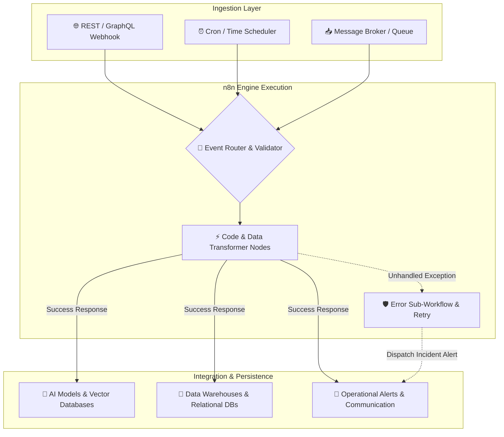

<div align="center">

# ⚡ n8n Advanced Workflows & Enterprise Automation Blueprints

[](https://n8n.io)
[](https://docs.n8n.io/workflows/export-import/)
[](LICENSE)
[](CONTRIBUTING.md)

**An enterprise-grade repository of modular, production-tested n8n JSON workflow blueprints.**  
Designed for scalable AI agent orchestration, real-time data streaming (ETL), incident reporting, and transactional business operations.

---

[📖 Quick Start](#-getting-started--importing) • [🗂️ Blueprint Catalog](#-interactive-blueprint-catalog) • [🏗️ System Topology](#-architecture--data-flow) • [📊 Metrics & Performance](#-performance--resource-benchmarks) • [❓ FAQ](#-troubleshooting--faq)

---

</div>

## 📌 Interactive Blueprint Catalog

Explore our collection of modular JSON blueprints categorized by execution domain. Click on any category to view node dependencies, schema definitions, and file locations.

<details open>
<summary><b>🤖 AI & Agentic Orchestration (<code>/ai-agents</code>)</b></summary>
<br>

> Advanced artificial intelligence pipelines utilizing LangChain, vector search, autonomous tools, and memory layers.

| Blueprint | Key Components & Nodes | Primary Use Case | JSON Blueprint |
| :--- | :--- | :--- | :---: |
| **Hybrid RAG Knowledge Assistant** | `OpenAI`, `Qdrant Vector DB`, `Window Buffer Memory`, `Telegram` | Contextual Q&A over custom document stores with conversational memory. | [`ai-agents/rag-assistant.json`](./ai-agents/) |
| **Autonomous Multi-Agent Router** | `LangChain Agent`, `Switch Node`, `Anthropic Claude 3.5`, `SerpAPI` | Evaluates inbound queries and routes tasks dynamically to specialized web/code sub-agents. | [`ai-agents/multi-agent-router.json`](./ai-agents/) |
| **Multimodal Document Parser** | `PDF Extract`, `GPT-4 Vision`, `Code (JS)`, `SendGrid Email` | Extracts structured JSON payloads from unstructured PDFs, invoices, and images. | [`ai-agents/doc-summarizer.json`](./ai-agents/) |

</details>

<details>
<summary><b>📊 Enterprise Data Pipelines & ETL (<code>/etl-pipelines</code>)</b></summary>
<br>

> High-throughput data syncing, transformation workflows, and real-time CDC (Change Data Capture) automation.

| Blueprint | Key Components & Nodes | Primary Use Case | JSON Blueprint |
| :--- | :--- | :--- | :---: |
| **PostgreSQL to BigQuery CDC** | `Postgres Trigger`, `Code (Batching)`, `Google BigQuery`, `Error Hook` | Stream incremental database updates into cloud data warehouses with rate limits. | [`etl-pipelines/postgres-to-bigquery.json`](./etl-pipelines/) |
| **Google Sheets Realtime Webhook** | `Webhook Trigger`, `Schema Validator`, `Google Sheets Node` | Ingests external REST API calls, cleans input schema, and writes rows without locks. | [`etl-pipelines/sheets-webhook-sync.json`](./etl-pipelines/) |
| **MySQL to Redis Invalidation** | `MySQL Listener`, `Redis Cache Node`, `Slack Notification` | Purges cached keys in real time when underlying database records are mutated. | [`etl-pipelines/mysql-redis-cache.json`](./etl-pipelines/) |

</details>

<details>
<summary><b>🔔 Incident Response & DevOps Monitoring (<code>/devops-alerts</code>)</b></summary>
<br>

> Real-time monitoring, webhook handlers, and automated operations for software development teams.

| Blueprint | Key Components & Nodes | Primary Use Case | JSON Blueprint |
| :--- | :--- | :--- | :---: |
| **GitHub Webhook Intelligence** | `GitHub Webhook`, `Slack Block Kit`, `Filter Node` | Parses release tags, PR updates, and issue events to render interactive Slack cards. | [`devops-alerts/github-slack-bot.json`](./devops-alerts/) |
| **Uptime Monitor & Alert Engine** | `Cron Schedule`, `HTTP Request`, `PagerDuty API`, `Discord` | Performs global health checks every 60s and triggers incident workflows on non-200 responses. | [`devops-alerts/uptime-monitor.json`](./devops-alerts/) |

</details>

<details>
<summary><b>💼 Financial & CRM Operations (<code>/crm-automations</code>)</b></summary>
<br>

> Transactional workflows, billing, customer enrichment, and automated communication.

| Blueprint | Key Components & Nodes | Primary Use Case | JSON Blueprint |
| :--- | :--- | :--- | :---: |
| **Stripe Invoice & Drive Storage** | `Stripe Webhook`, `HTML-to-PDF`, `Google Drive Node` | Generates branded PDF receipts upon successful payment intents and archives them. | [`crm-automations/stripe-invoicing.json`](./crm-automations/) |
| **HubSpot Lead Enrichment** | `HubSpot Trigger`, `Clearbit REST API`, `SendGrid Mail` | Enriches new inbound leads with company revenue and headcount before alerting sales teams. | [`crm-automations/hubspot-enrichment.json`](./crm-automations/) |

</details>

---

## 🏗️ Architecture & Data Flow

The diagram below illustrates how n8n acts as the central execution engine for these JSON blueprints across external webhooks, data transformers, and third-party APIs:



---

## 📊 Performance & Resource Benchmarks

The chart and matrix below outline average latency and RAM overhead when executing these blueprints in standard self-hosted environments.

```mermaid
gantt
    title Execution Phase Latency Breakdown (Typical Workflow)
    dateFormat SS
    axisFormat %S s

    section Ingestion
    Payload Validation & Auth :a1, 00, 1s
    section Processing
    JSON Mutation & Filtering :a2, after a1, 2s
    section External Call
    LLM / Database Query      :a3, after a2, 4s
    section Delivery
    Webhook Acknowledgment    :a4, after a3, 1s
```



### ⚡ Resource Utilization Matrix

| Execution Profile | Latency Target | RAM Consumption | Failure Recovery Strategy |
| :--- | :---: | :---: | :--- |
| **Lightweight API Router** | `< 150ms` | `~30 MB` | Immediate Failover Node |
| **ETL / Data Batch Pipeline** | `~500ms - 2.5s` | `~250 MB` | Exponential Backoff (3 Retries) |
| **AI / RAG Agent Pipeline** | `~1.8s - 4.5s` | `~140 MB` | Dead-Letter Sub-Workflow Route |

---

## 🚀 Getting Started & Importing

### Option 1: Direct Clipboard Import (Recommended)

1. Navigate to the desired `.json` file in the directory above (e.g., `ai-agents/rag-assistant.json`).
2. Click **Raw** in the top-right corner of the GitHub interface.
3. Select all code (`Ctrl+A` / `Cmd+A`) and copy it (`Ctrl+C` / `Cmd+C`).
4. Open your **n8n Canvas**.
5. Press `Ctrl+V` (or `Cmd+V` on macOS). The blueprint will render directly onto your canvas.

```text
[ GitHub Raw JSON ] ──► Copy All ──► Open n8n Canvas ──► Ctrl+V ──► Instant Render!
```

### Option 2: Repository Clone

```bash
# 1. Clone the repository
git clone https://github.com/Junaidparacha1995/n8n_Advanced_Workflows.git
cd n8n_Advanced_Workflows

# 2. Open n8n Editor UI -> Workflows -> Import from File
# 3. Select any blueprint JSON from the downloaded directories
```

---

## 🛠️ JSON Blueprint Schema Overview

All workflows provided in this repository adhere to the standard `n8n v1` schema specification:

```json
{
  "name": "Production Blueprint Template",
  "nodes": [
    {
      "parameters": {
        "httpMethod": "POST",
        "path": "v1/process-data"
      },
      "name": "Inbound Webhook Node",
      "type": "n8n-nodes-base.webhook",
      "typeVersion": 1,
      "position": [240, 300]
    }
  ],
  "connections": {
    "Inbound Webhook Node": {
      "main": [[{ "node": "Process Data", "type": "main", "index": 0 }]]
    }
  },
  "settings": { "executionOrder": "v1" }
}
```

---

## ❓ Troubleshooting & FAQ

<details>
<summary><b>Q: Red "Node Type Not Found" warning upon importing JSON?</b></summary>
<br>

* **Cause:** The workflow relies on a community node or an n8n feature introduced in a newer n8n release.
* **Solution:** Upgrade your n8n docker image (`docker pull n8nio/n8n:latest`) or install the required custom node under **Settings → Community Nodes** in your n8n dashboard.

</details>

<details>
<summary><b>Q: Credentials show as red/unconfigured after import?</b></summary>
<br>

* **Cause:** For security compliance, API tokens, OAuth credentials, and passwords are omitted from all repository JSON files.
* **Solution:** Click the affected node, navigate to the **Credential** dropdown, and select or create your environment credentials.

</details>

---

## 🤝 Contributing

We welcome community contributions! To add a new workflow blueprint:

1. Export your clean workflow from n8n (**Workflows → Download**).
2. Sanitize any secrets, private domain URLs, or tokens.
3. Save the `.json` file in the corresponding topic directory.
4. Update the [Interactive Blueprint Catalog](#-interactive-blueprint-catalog) table in `README.md`.
5. Open a **Pull Request**.

---

## 📜 License

Distributed under the **MIT License**. See `LICENSE` for details.